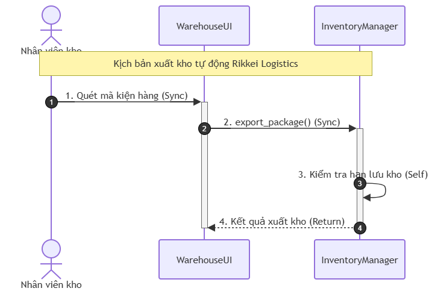

# BÀI TẬP: SỬA LỖI BIỂU ĐỒ TUẦN TỰ (SEQUENCE DIAGRAM)
## PHÂN HỆ XUẤT KHO - RIKKEI LOGISTICS

---

### PHẦN 1: XÁC ĐỊNH VÀ GIẢI THÍCH LỖI SAI

Dựa trên đối chiếu giữa bản vẽ "Sequence Diagram hiện trường giả" và **Kịch bản nghiệp vụ đúng cùng Quy tắc nghiệp vụ (Mục 3)**:

#### 1. Lỗi 1: Sai loại thông điệp và sai đối tượng thực hiện thao tác "Kiểm tra hạn lưu kho"
* **Hiện trạng trên bản vẽ giả:** 
  * `InventoryManager` gửi một thông điệp đồng bộ sang đối tượng bên ngoài là `ExpiryChecker` (`Kiểm tra hạn lưu kho`).
* **Lý do sai theo quy tắc nghiệp vụ:**
  * Kịch bản nghiệp vụ nêu rõ: *"InventoryManager tự kiểm tra hạn lưu kho của kiện hàng trên chính nó (thao tác nội bộ)."*
  * Quy tắc nghiệp vụ quy định: *"Một đối tượng tự thực hiện thao tác nội bộ trên chính nó phải dùng thông điệp Tự gọi (Self), không được gửi sang đối tượng khác."*
  * Việc tạo thêm đối tượng `ExpiryChecker` và gửi thông điệp sang đó vi phạm trực tiếp quy tắc xử lý nội bộ và làm sai kiến trúc luồng dữ liệu của phân hệ.
* **Cách sửa chuẩn:**
  * Bỏ đối tượng `ExpiryChecker`.
  * Đổi thông điệp "Kiểm tra hạn lưu kho" thành **Thông điệp Tự gọi (Self Message)** từ `InventoryManager` trỏ về chính lifeline của `InventoryManager`.

---

#### 2. Lỗi 2: Sai loại thông điệp trả kết quả "Kết quả xuất kho"
* **Hiện trạng trên bản vẽ giả:** 
  * Thông điệp `Kết quả xuất kho` từ `InventoryManager` về `WarehouseUI` đang vẽ bằng **đường nét liền có mũi tên nhọn đặc (Solid line with filled arrowhead)** — đây là ký hiệu của **Thông điệp Đồng bộ (Synchronous Call Message)**.
* **Lý do sai theo quy tắc nghiệp vụ:**
  * Quy tắc nghiệp vụ quy định: *"Kết quả trả về sau khi xử lý xong phải dùng thông điệp Phản hồi (Return), không dùng lại thông điệp Đồng bộ."*
  * Trong chuẩn UML, thông điệp phản hồi kết quả sau một lời gọi đồng bộ (Sync Call) bắt buộc phải là **Return Message**, ký hiệu bằng **đường nét đứt và mũi tên hở (Dashed line with open arrowhead: `--->`)**.
* **Cách sửa chuẩn:**
  * Đổi thông điệp `Kết quả xuất kho` thành **Thông điệp Phản hồi (Return Message / Reply Message)** với nét đứt (`dashed line`) và mũi tên mở (`open arrowhead`).

---

### PHẦN 2: BẢNG TỔNG HỢP 4 THÔNG ĐIỆP CHUẨN UML THEO THỨ TỰ THỜI GIAN

| Thứ tự | Tên thông điệp | Đối tượng gửi (Source) | Đối tượng nhận (Target) | Loại thông điệp UML | Ký hiệu đường vẽ UML | Ghi chú nghiệp vụ |
| :---: | :--- | :--- | :--- | :--- | :--- | :--- |
| **1** | Quét mã kiện hàng | `Nhân viên kho` | `WarehouseUI` | **Synchronous Message (Sync)** | Nét liền, mũi tên đặc (`—►`) | Nhân viên thao tác quét mã trên giao diện ki-ốt |
| **2** | `export_package()` | `WarehouseUI` | `InventoryManager` | **Synchronous Message (Sync)** | Nét liền, mũi tên đặc (`—►`) | UI gọi hàm xuất kho và chờ kết quả từ hệ thống |
| **3** | Kiểm tra hạn lưu kho | `InventoryManager` | `InventoryManager` | **Self Message (Tự gọi nội bộ)** | Nét liền uốn cong vòng lại chính nó, mũi tên đặc (`—►`) | Thao tác nội bộ kiểm tra điều kiện xuất kho trên chính đối tượng |
| **4** | Kết quả xuất kho | `InventoryManager` | `WarehouseUI` | **Return Message (Phản hồi)** | Nét đứt, mũi tên hở (`- - - >`) | Trả kết quả thành công/thất bại về UI cho nhân viên xem |

---

### PHẦN 3: BIỂU ĐỒ TUẦN TỰ CHUẨN

