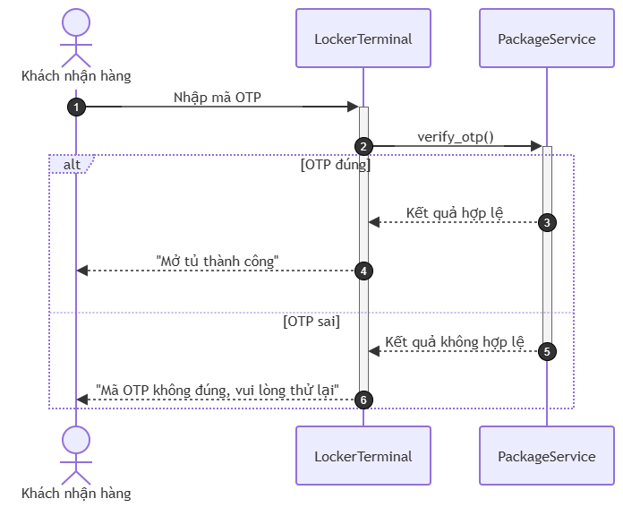

# BÀI TẬP: ĐIỀN KHUYẾT LUỒNG NHẬN HÀNG TẠI TỦ SMART LOCKER
## PHÂN HỆ LOCKER - RIKKEI LOGISTICS SMART LOCKER

---

### PHẦN 1: XÁC ĐỊNH THIẾU SÓT VÀ GIẢI THÍCH

Đối chiếu giữa bản vẽ "Sequence Diagram hiện tại" với **Kịch bản nghiệp vụ** và **Quy tắc nghiệp vụ (Mục 3)**:

#### 1. Chỉ ra thiếu sót trên sơ đồ hiện tại
* Bản vẽ hiện tại chỉ mô tả duy nhất kịch bản thành công (Happy Case): `PackageService` trả về `Kết quả hợp lệ` và `LockerTerminal` phản hồi `"Mở tủ thành công"`.
* Toàn bộ các thông điệp phản hồi kết quả đang được đặt trong một luồng tuần tự thẳng đứng cố định, **hoàn toàn thiếu khối rẽ nhánh kết hợp `alt / else` (Combined Fragment: Alternative)**.
* Thiếu hoàn toàn nhánh xử lý khi **OTP sai** (`Kết quả không hợp lệ` và thông báo `"Mã OTP không đúng, vui lòng thử lại"`).

#### 2. Vì sao thiếu khối `alt / else` khiến sơ đồ không mô tả đủ nghiệp vụ?
* **Bản chất của Sequence Diagram tuần tự:** Mọi thông điệp xuất hiện trên Lifeline mà không nằm trong fragment điều kiện sẽ mặc định luôn luôn xảy ra theo thứ tự thời gian.
* **Theo quy tắc nghiệp vụ:** Kết quả xác thực OTP rẽ nhánh loại trừ lẫn nhau (Mutual Exclusion): chỉ có 2 khả năng xảy ra là **OTP đúng** hoặc **OTP sai**, không bao giờ xảy ra đồng thời.
* **Hậu quả khi thiếu khối `alt / else`:** 
  * Đội ngũ phát triển (Dev) và kiểm thử (Tester) khi nhìn vào biểu đồ sẽ hiểu nhầm hệ thống chỉ có một luồng duy nhất luôn mở tủ thành công.
  * Không có đặc tả cho trường hợp xử lý ngoại lệ (mã OTP sai), dẫn đến việc hệ thống có thể bị cài đặt thiếu luồng báo lỗi cho khách hàng.

---

### PHẦN 2: ĐẶC TẢ CHI TIẾT KHỐI RẼ NHÁNH VÀ LUỒNG THÔNG ĐIỆP CHUẨN UML

#### 1. Luồng chuẩn bị (Trước khối rẽ nhánh)
1. **Khách nhận hàng -> LockerTerminal**: `Nhập mã OTP` (*Synchronous Message*)
2. **LockerTerminal -> PackageService**: `verify_otp()` (*Synchronous Message*)

#### 2. Khối rẽ nhánh `alt` (Combined Fragment: Alternative)

| Phân vùng điều kiện (Guard condition) | Thứ tự | Tên thông điệp | Đối tượng gửi (Source) | Đối tượng nhận (Target) | Loại thông điệp UML | Ký hiệu chuẩn UML |
| :--- | :---: | :--- | :--- | :--- | :--- | :--- |
| **Nhánh `[OTP đúng]`** | **3a** | Kết quả hợp lệ | `PackageService` | `LockerTerminal` | **Return Message** | Nét đứt, mũi tên hở (`- - - >`) |
| *(Phần trên của alt)* | **4a** | "Mở tủ thành công" | `LockerTerminal` | `Khách nhận hàng` | **Return Message** | Nét đứt, mũi tên hở (`- - - >`) |
| **Nhánh `else [OTP sai]`** | **3b** | Kết quả không hợp lệ | `PackageService` | `LockerTerminal` | **Return Message** | Nét đứt, mũi tên hở (`- - - >`) |
| *(Phần dưới ngăn cách bằng nét đứt)* | **4b** | "Mã OTP không đúng, vui lòng thử lại" | `LockerTerminal` | `Khách nhận hàng` | **Return Message** | Nét đứt, mũi tên hở (`- - - >`) |

---

### PHẦN 3: BIỂU ĐỒ TUẦN TỰ HOÀN CHỈNH

